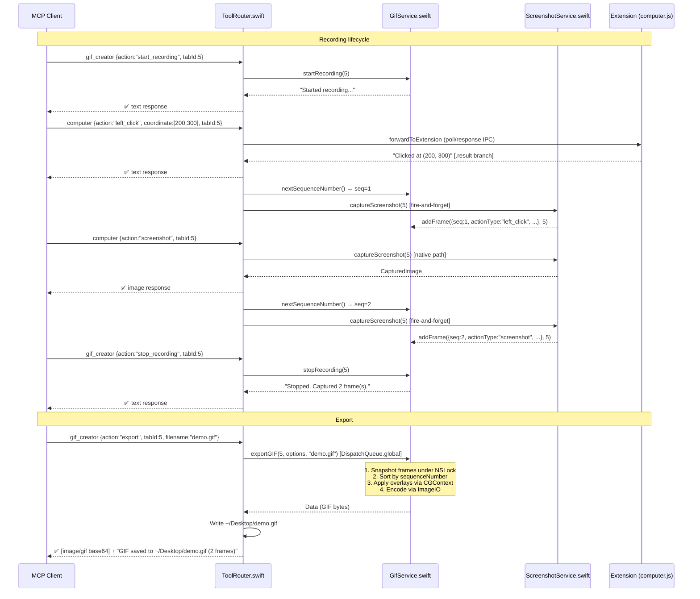

# Spec 017 — gif_creator

## Revised Architecture (v3) — Supersedes Original Spec

> **This section is the authoritative implementation guide.** The original spec sections
> below (Overview through Test Cases) are retained for historical context. Where they
> conflict with this section, this section takes precedence.
>
> **Reviewed and approved:** 2026-03-12. Three architecture review passes completed.

### Key Design Decisions

**gif_creator is a native tool.** Handled entirely by `ToolRouter`, like `screenshot` and
`resize_window`. Not forwarded to the extension. No `gif-creator.js` needed.

**Scope key: tabId (not tabGroupId).** GifService uses `tabId` as the frame buffer scope
key. Avoids cross-process tabGroupId resolution. `resolveTabGroup` is not needed.

**GIF delivery: Desktop file + MCP image response.**
1. Write GIF to `~/Desktop/<filename>.gif`
2. Return `{ type: "image", data: base64, mimeType: "image/gif" }` + path text in MCP response

In-browser drag-drop delivery deferred until `upload_image` (Spec 018) validates the
DataTransfer injection pattern in Safari. See Future Items below.

### What Changed from Original Spec

| Original Assumption | Revised Decision |
|---------------------|-----------------|
| `gif-creator.js` extension tool handler | Removed — gif_creator is native |
| `globalThis.gifRecorder` JS contract | Removed — ToolRouter post-action hook replaces this |
| `computer.js` checks `gifRecorder.isRecording()` | Removed — ToolRouter handles it |
| Frames persisted to App Group container files | In-memory GifService (native app doesn't suspend) |
| gif.js Web Worker library | Removed — native ImageIO is more reliable |
| `browser.storage.session` for recording state | Removed — state in GifService in-memory |
| `globalThis.resolveTabGroup` export | Removed — tabId used as scope key |
| Export via `<a download>` in extension | Removed — Desktop file write, no frontmost req. |
| Export via drag-drop DataTransfer | Deferred to ROADMAP (after Spec 018) |
| Scope by tab group | Scope by tabId |
| `kUTTypeGIF` UTI constant | `"com.compuserve.gif"` string literal (kUTTypeGIF deprecated macOS 12+) |

### GifService.swift (new)

Owns all GIF state and encoding. Instantiated inline in `ToolRouter` (same pattern as
`ScreenshotService`). Thread-safe via NSLock.

```swift
class GifService {

    struct GifFrame {
        let sequenceNumber: Int       // monotonic; assigned at dispatch time for ordering
        let imageData: Data           // PNG-encoded, from ScreenshotService
        let actionType: String        // e.g. "left_click", "scroll", "type", "screenshot"
        let coordinate: [Int]?        // parsed via compactMap/NSNumber (same as zoom region)
        let timestamp: Date
        let viewportWidth: Int
        let viewportHeight: Int
    }

    struct GifOptions {
        var showClicks: Bool    = true
        var showActions: Bool   = true
        var showProgress: Bool  = true
        var showWatermark: Bool = true
    }

    func startRecording(tabId: Int) -> String
    func stopRecording(tabId: Int) -> String
    func isRecording(tabId: Int) -> Bool
    func frameCount(tabId: Int) -> Int

    // Atomically increments and returns the global sequence counter.
    // MUST be called before the async screenshot callback to preserve dispatch-time ordering.
    func nextSequenceNumber() -> Int

    // Enforces 50-frame ring buffer.
    func addFrame(_ frame: GifFrame, tabId: Int)

    // Snapshot semantics: copies frame array under NSLock, releases lock, encodes from snapshot.
    // Concurrent addFrame calls during encoding are safe.
    func exportGIF(tabId: Int, options: GifOptions, filename: String) -> Result<Data, Error>

    func clearFrames(tabId: Int) -> String
}
```

**GIF encoding** uses ImageIO:
- `CGImageDestinationCreateWithData(mutableData, "com.compuserve.gif" as CFString, frameCount, nil)`
- Per-frame: decode PNG → CGImage, apply overlays via CGContext, `CGImageDestinationAddImage` with delay
- `CGImageDestinationFinalize` → Data

**Frame delay** (values in seconds as passed to `kCGImagePropertyGIFDelayTime`; ImageIO accepts
seconds as CFNumber, unlike the raw GIF89a format which uses centiseconds):

| Action type | Delay (s) |
|-------------|-----------|
| `screenshot`, `zoom` | 0.3 |
| `scroll`, `scroll_to`, `navigate`, `type`, `key`, `hover` | 0.8 |
| `left_click`, `right_click`, `double_click`, `triple_click`, `left_click_drag` | 1.5 |
| (default) | 0.8 |

**Visual overlays** (CGContext drawing):
- `showClicks`: red filled circle r=12pt + outer ring r=20pt 2pt stroke at coordinate
- `showActions`: filled rounded-rect label at bottom with action text
- `showProgress`: 3pt-tall rect at top, width = (frameIndex/totalFrames) × imageWidth
- `showWatermark`: "Recorded with Claude" bottom-right, 11pt system font, 60% white

**Thread safety:** All mutable state under a single NSLock. `exportGIF` copies frame array
under lock, releases immediately, encodes from snapshot. `exportGIF` sorts frames by
`sequenceNumber` before encoding to handle out-of-order async captures.

### ToolRouter.swift changes

New branch in `handleToolCall`:
```swift
} else if toolName == "gif_creator" {
    handleGifCreator(arguments: arguments, id: id, clientId: clientId)
}
```

`handleGifCreator` dispatches `start_recording`/`stop_recording`/`clear` synchronously.
`export` dispatches to `DispatchQueue.global(qos: .userInitiated)` (encoding is 100ms–2s).

`tabId` sentinel: `(arguments["tabId"] as? Int) ?? -1` — `-1` for missing tabId
(no valid Safari tab ID is negative).

**Post-action frame capture hook** — called **only from the `.result` (success) branch**
of `deliverExtensionResponse`, never from `.error`. Also called from `handleScreenshotAction`
after a successful native capture. Fire-and-forget; does not block MCP response:

```swift
private func maybeAddGifFrame(tabId: Int, action: String, coordinate: [Int]?) {
    guard gifService.isRecording(tabId: tabId) else { return }
    let seq = gifService.nextSequenceNumber()   // assigned before async capture
    screenshotService.captureScreenshot(tabId: tabId) { [weak self] result in
        guard let self, case .success(let img) = result else { return }
        self.gifService.addFrame(GifService.GifFrame(
            sequenceNumber: seq, imageData: img.data, actionType: action,
            coordinate: coordinate, timestamp: Date(),
            viewportWidth: img.viewportWidth, viewportHeight: img.viewportHeight
        ), tabId: tabId)
    }
}
```

Coordinates parsed with NSNumber-tolerant compactMap (same pattern as zoom region in ToolRouter).

### Data Flow



### Error Handling

| Condition | Behavior |
|-----------|----------|
| `action` missing | `isError: true`, "action parameter is required" |
| `action` invalid | `isError: true`, "Invalid action: \"<x>\"…" |
| Export with no frames | `isError: true`, "No frames recorded for tab `<tabId>`" |
| GIF encoding fails | `isError: true`, "GIF encoding failed: `<error>`" |
| Desktop write fails | Success with warning in path text; base64 still returned |
| `start_recording` when already recording | "Recording is already active…" (not error) |
| `stop_recording` when not recording | "Recording is not active…" (not error) |
| `export` while recording | Valid — exports current frames, recording continues |
| `tabId` missing | Uses -1 sentinel (single-tab fallback) |

### Files to Create / Modify

| File | Change |
|------|--------|
| `ClaudeInSafari/Services/GifService.swift` | **Create** |
| `ClaudeInSafari/MCP/ToolRouter.swift` | **Modify** — native dispatch + post-action hook |
| `Tests/Swift/GifServiceTests.swift` | **Create** |
| `Tests/Swift/ToolRouterGifHookTests.swift` | **Create** |
| `ROADMAP.md` | **Modify** — mark 017 ✅; add in-browser delivery as future item |

No changes to: `AppDelegate.swift`, `SafariWebExtensionHandler.swift`, `manifest.json`,
`background.js`, `tabs-manager.js`, any extension JS, or `ClaudeInSafari.entitlements`
(app is not sandboxed; Desktop writes work. If App Store sandboxing added in Phase 7,
change target to App Group container or add `com.apple.security.files.downloads.read-write`).

### Future ROADMAP Item: In-Browser GIF Delivery

After `upload_image` (Spec 018) validates DataTransfer injection in Safari:
- Add `coordinate: [x, y]` export mode → inject GIF as File + dragenter/dragover/drop
- **Validation checkpoint:** verify `new DataTransfer()` is constructible in Safari 16.4+
  content scripts before implementing (known Chrome/Safari divergence)

### Test Coverage

**GifServiceTests.swift:**

| ID | Test |
|----|------|
| T1 | startRecording → isRecording true → stopRecording → isRecording false |
| T2 | startRecording twice → "already active", state unchanged |
| T3 | stopRecording when not recording → "not active" |
| T4 | addFrame ×50 → frameCount==50; 51st evicts oldest |
| T5 | exportGIF with zero frames → `.failure` |
| T6 | exportGIF produces Data with GIF magic bytes ("GIF8") |
| T7 | exportGIF frame delay matches timing table per action type |
| T8 | clearFrames → frameCount==0, isRecording false |
| T9 | Concurrent addFrame → no crash, correct count |
| T10 | exportGIF concurrent with addFrame → no data race |
| T11 | Out-of-order sequenceNumbers → sorted correctly in export |
| T12 | exportGIF with showClicks:false → no crash |

**ToolRouterGifHookTests.swift:**

| ID | Test |
|----|------|
| T1 | gif_creator start_recording → success text, isRecording true |
| T2 | gif_creator stop_recording → "Stopped. Captured N frames." |
| T3 | Hook does NOT fire for `wait` action |
| T4 | Hook does NOT fire when isRecording false |
| T5 | Hook fires for `left_click` when recording — addFrame called |
| T6 | handleScreenshotAction calls maybeAddGifFrame when recording |
| T7 | gif_creator export → image/gif content block + text with file path |
| T8 | gif_creator export with no frames → isError: true |
| T9 | gif_creator invalid action → isError: true |
| T10 | Hook does NOT fire when extension returns error response |

---

## Overview (Original Spec — for historical context)

`gif_creator` manages animated GIF recording for browser automation sessions. It controls
when to start/stop capturing screenshot frames during automation actions, then exports
the captured frames as an animated GIF with optional visual overlays (click indicators,
action labels, progress bar, watermark).

## Scope (Original)

- Background: `ClaudeInSafari Extension/Resources/tools/gif-creator.js`
- Library: `ClaudeInSafari Extension/Resources/lib/gif.js` (GIF encoder)
- Native: `ScreenshotService.swift` (frame capture via ScreenCaptureKit)
- Tool name: `"gif_creator"`

## Tool Arguments

```ts
{
  action:    "start_recording" | "stop_recording" | "export" | "clear";  // Required
  tabId:     number;    // Tab ID to scope the recording to (required)
  coordinate?: [number, number];  // Viewport [x, y] for drag-drop upload (export only)
  download?: boolean;   // If true, download the GIF instead of drag-drop. Default: false.
  filename?: string;    // Optional filename (default: "recording-<timestamp>.gif")
  options?:  {          // Optional GIF enhancement settings (export only)
    showClicks?:    boolean;  // Show click indicator overlays. Default: true.
    showActions?:   boolean;  // Show action label overlays. Default: true.
    showProgress?:  boolean;  // Show progress bar. Default: true.
    showWatermark?: boolean;  // Show "Recorded with Claude" watermark. Default: true.
  }
}
```

## Actions

### start_recording

1. Clear any previously captured frames for this tab group.
2. Mark the tab group as "recording."
3. From this point, every `computer` action (click, scroll, navigate, type, etc.) that
   includes a screenshot automatically adds the frame to the recording buffer.
4. Maximum frames: **50**. After 50, the oldest frame is evicted (ring buffer).
5. Return confirmation: `"Started recording browser actions for this tab group."`

If already recording: return `"Recording is already active for this tab group."` (not error).

### stop_recording

1. Mark the tab group as "not recording."
2. Frames remain in the buffer for later export.
3. Return: `"Stopped recording. Captured <N> frame(s)."`

If not recording: return `"Recording is not active for this tab group."` (not error).

### export

1. Retrieve all captured frames for the tab group.
2. If no frames: return `isError: true`, `"No frames recorded."`.
3. Generate the animated GIF using `gif.js`:
   a. For each frame, apply visual overlays based on `options`.
   b. Set frame delay based on the action type (see Frame Timing below).
   c. Encode as GIF.
4. Deliver the GIF:
   - If `download: true`: encode as a data URL and trigger a download via
     `browser.downloads.download()` or a dynamically created `<a>` element.
   - If `coordinate` is provided: simulate a drag-drop upload at the given coordinates
     (inject the GIF as a `File` object and dispatch drag/drop events).
   - If neither: return `isError: true`, `"Provide coordinate or set download: true"`.

### clear

1. Discard all captured frames for the tab group.
2. Stop recording if active.
3. Return: `"Cleared all recorded frames."`.

## Frame Capture

### How Frames Are Captured

Frames are **not** captured by the GIF creator itself. Instead, the `computer` tool
(Spec 010/011) captures a screenshot after each action when recording is active.
The `computer` tool checks `gif-creator.js`'s recording state and, if recording, stores
the frame with metadata:

```ts
interface GifFrame {
  base64:         string;   // PNG screenshot data
  format:         "png";
  action:         {
    type: string;           // "left_click", "scroll", "type", etc.
    coordinate?: [number, number];
    text?: string;
  };
  viewportWidth:  number;
  viewportHeight: number;
  timestamp:      number;
}
```

### Frame Timing

Each frame's display duration in the GIF is determined by the action type:

| Action Type | Frame Delay (ms) |
|-------------|-----------------|
| screenshot | 300 |
| scroll, scroll_to, navigate | 800 |
| type, key | 800 |
| zoom | 800 |
| left_click, right_click | 1500 |
| double_click, triple_click | 1500 |
| left_click_drag | 1500 |
| hover | 800 |
| (default) | 800 |

### Visual Overlays (Export)

When `options` flags are true (all default to true):

- **showClicks:** Draw a red circle with expanding ripple at click coordinates.
- **showActions:** Draw a label bar at the bottom showing the action text
  (e.g., "Clicked at (350, 200)", "Typed 'hello'").
- **showProgress:** Draw a thin progress bar at the top showing frame position.
- **showWatermark:** Draw "Recorded with Claude" text in the bottom-right corner.

Overlays are rendered onto each frame's canvas before GIF encoding.

## Frame Storage

Frames must be **persisted** rather than held in background page memory, because the
MV2 background page (`persistent: false`) can be suspended at any time, especially under
memory pressure. A 50-frame buffer of full-size PNGs (~100MB of base64) would itself
trigger the conditions that cause suspension.

### Storage Architecture

Frames are stored in the **App Group shared container** via the native bridge:

1. When a frame is captured, the `computer` tool sends it to the native app via native
   messaging (the screenshot data already originates there via ScreenCaptureKit).
2. The native app writes each frame to the App Group container as a numbered PNG file:
   `<appGroup>/gif-frames/<tabGroupId>/frame-<N>.png`
3. Frame metadata (action type, timestamp, viewport size) is stored in a JSON index file:
   `<appGroup>/gif-frames/<tabGroupId>/index.json`
4. Recording state (active/inactive) is tracked in `browser.storage.session` to survive
   background page restarts within the same session.

The background page script (`gif-creator.js`) coordinates between the extension and
native app, but does not hold frame data in memory.

### Inter-Module Contract

`gif-creator.js` must export a shared interface on `globalThis` for the `computer` tool
to call (per CLAUDE.md inter-module contract rules):

```ts
globalThis.gifRecorder = {
  isRecording(tabGroupId: number): boolean;
  addFrame(tabGroupId: number, frame: GifFrame): void;
};
```

This interface must be documented in the `gif-creator.js` file header and referenced
from `computer.js`.

### Tab Group Resolution

The `tabId` argument is a virtual tab ID. To scope frames by tab group, `gif-creator.js`
must resolve the tab's group via a new `globalThis` export from `tabs-manager.js`:

```ts
globalThis.resolveTabGroup = async function(virtualTabId: number): Promise<number>;
// Returns the group ID containing the given virtual tab ID.
```

This must be explicitly added to `tabs-manager.js` and documented per the inter-module
contract rules in CLAUDE.md.

## Return Value

```ts
// start_recording / stop_recording / clear
{
  content: [{ type: "text", text: "<confirmation message>" }]
}

// export (download mode)
{
  content: [{ type: "text", text: "GIF exported and downloaded as <filename>" }]
}

// export (coordinate/drag-drop mode)
{
  content: [{ type: "text", text: "GIF uploaded to page at (<x>, <y>)" }]
}
```

## Error Handling

| Condition | Behavior |
|-----------|----------|
| `action` missing | `isError: true`, "action parameter is required" |
| `tabId` missing | `isError: true`, "tabId parameter is required" |
| Export with no frames | `isError: true`, "No frames recorded for this tab group" |
| Export without coordinate or download | `isError: true`, "Provide coordinate for drag-drop or set download: true" |
| Tab not found | `isError: true`, "Tab `<tabId>` not found" |
| GIF encoding fails | `isError: true`, "GIF encoding failed: `<error>`" |
| Drag-drop upload fails | `isError: true`, "Failed to upload GIF: `<error>`" |

## GIF Encoding

### Native-Side Encoding (Recommended)

GIF encoding should be performed in the **native app** rather than using `gif.js` Web
Workers in the background page. This is recommended because:

1. Safari's MV2 background page may not reliably support Web Worker instantiation, and
   Workers can be terminated if the page suspends.
2. The frame PNG data already resides on the native side (App Group container).
3. Swift has robust image encoding via `CGImage` and `ImageIO` (`CGAnimatedImageDestination`
   or frame-by-frame `CGImageDestinationAddImage` with `kUTTypeGIF`).
4. Visual overlays (click indicators, action labels, progress bar, watermark) can be
   rendered via Core Graphics, which is more reliable than `CanvasRenderingContext2D` in
   a background page.

The `export` action sends a native message requesting GIF encoding. The native app reads
frames from the App Group container, applies overlays, encodes the GIF, and returns the
result (base64 or file path).

### Fallback: gif.js in Background Page

If native encoding proves impractical for a specific scenario, `gif.js` with synchronous
encoding (no Web Workers) can be used as a fallback. The `gif.js` library and its worker
must be listed in `web_accessible_resources` in the manifest. However, this path should be
treated as secondary.

## Safari Considerations

### ⚠ Frame Capture Latency

In Chrome, frames are captured via `chrome.tabs.captureVisibleTab()` — a fast, in-process
call. In Safari, frames are captured via ScreenCaptureKit in the native app. Since frames
are written directly to the App Group container (no base64 round-trip through the
extension), the per-frame overhead is primarily disk I/O (~10-50ms per frame).

**Impact:** Slightly lower effective frame rates during fast automation sequences.
GIFs may have slightly more "jumpy" transitions between frames. The 50-frame cap (same
as Chrome) effectively limits recording to shorter sequences.

**Mitigation:** Frame capture happens asynchronously and does not block the automation
action itself. The latency only affects GIF quality, not automation speed.

### ✅ Frames Survive Background Page Suspension

Unlike an in-memory approach, persisting frames to the App Group container means they
survive background page suspension. Recording state is tracked in
`browser.storage.session`, which also survives within the same session.

### GIF Delivery

The `export` action delivers the GIF via one of two mechanisms:

- **Download:** The native app writes the GIF to a temporary file and the extension
  creates a dynamically injected `<a download>` element pointing to a `blob:` URL
  created from the GIF data. Note: `browser.downloads.download()` may not be available
  in Safari MV2; the `<a download>` approach is the primary mechanism.
- **Drag-drop upload:** Uses the same technique as `upload_image` (Spec 018) — injects
  the GIF as a `File` object and dispatches drag/drop events at the specified coordinates.

### Spec 011 Dependency

GIF frame capture for `screenshot` actions requires Spec 011 (`ScreenshotService`) to be
implemented. Until then, only non-screenshot `computer` actions can contribute frames.

## Chrome Parity Notes

| Feature | Chrome | Safari | Gap |
|---------|--------|--------|-----|
| Start/stop recording | ✅ | ✅ | None |
| Frame capture during actions | ✅ | ✅ | Safari has higher latency |
| Max 50 frames | ✅ | ✅ | None |
| Visual overlays (clicks, actions, progress, watermark) | ✅ | ✅ | None |
| Export via drag-drop | ✅ | ✅ | None |
| Export via download | ✅ | ✅ | None |
| Custom filename | ✅ | ✅ | None |
| gif.js encoder | ✅ | ✅ | None |
| Frame capture speed | Fast | Slightly slower | ~10-50ms disk I/O per frame |
| Frames survive page suspension | N/A (persistent) | ✅ | App Group persistence |
| GIF encoding | gif.js Web Workers | Native (ImageIO) | More reliable |

## Test Cases (Original)

| ID | Input | Expected Output |
|----|-------|-----------------|
| T1 | `action: "start_recording"` | Recording started confirmation |
| T2 | `action: "start_recording"` when already recording | "Already active" message |
| T3 | `action: "stop_recording"` after recording 5 actions | "Stopped. Captured 5 frames" |
| T4 | `action: "stop_recording"` when not recording | "Not active" message |
| T5 | `action: "export", download: true` with 10 frames | GIF downloaded |
| T6 | `action: "export", coordinate: [400, 300]` | GIF drag-dropped at coordinates |
| T7 | `action: "export"` with no frames | `isError: true` |
| T8 | `action: "export"` without coordinate or download | `isError: true` |
| T9 | `action: "clear"` | Frames discarded, confirmation |
| T10 | Record 60 actions (exceeds 50 frame cap) | Oldest frames evicted |
| T11 | Export with `options: { showClicks: false }` | GIF without click indicators |
| T12 | Export with custom filename | GIF named accordingly |
| T13 | `action` missing | `isError: true` |
| T14 | `tabId` missing | `isError: true` |
| T15 | `action: "export"` while still recording | Exports current frames (recording continues) |
| T16 | Background page suspended mid-recording | Frames survive in App Group container |
| T17 | `export` with `tabId` from different tab group | `isError: true`, no frames for that group |
